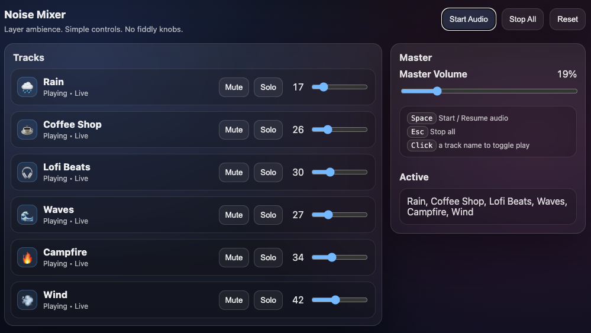

# Noise Mixer (Vanilla JS White Noise / Ambience Mixer)

A lightweight, dependency-free web app that lets users layer multiple ambience tracks (rain, café, waves, etc.) and control each track’s volume with user-friendly sliders. Built with **vanilla HTML/CSS/JavaScript** and the **Web Audio API**.

## Features

- ✅ Mix multiple ambience tracks simultaneously
- ✅ Per-track **volume slider** (easy to hit 0)
- ✅ Per-track **Play/Stop** (click the track name)
- ✅ Per-track **Mute** and **Solo**
- ✅ **Master volume** control
- ✅ Persists settings in `localStorage` (levels, mute/solo states, master volume)
- ✅ Keyboard shortcuts:
  - `Space` → Start / Resume audio
  - `Esc` → Stop all

> Note: Browsers require a user interaction before audio can play. Use the **Start Audio** button (or press Space).

---



## Tech Stack

- HTML + CSS
- Vanilla JavaScript
- Web Audio API (`AudioContext`, `GainNode`, `AudioBufferSourceNode`)

---

## Project Structure

```text
.
├── index.html
├── styles.css
├── app.js
└── audio/
    ├── rain.mp3
    ├── cafe.mp3
    ├── lofi.mp3
    ├── waves.mp3
    ├── fire.mp3
    └── wind.mp3
